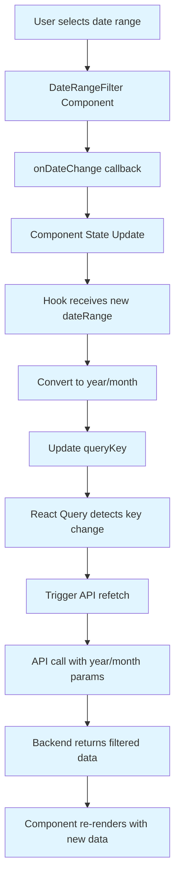
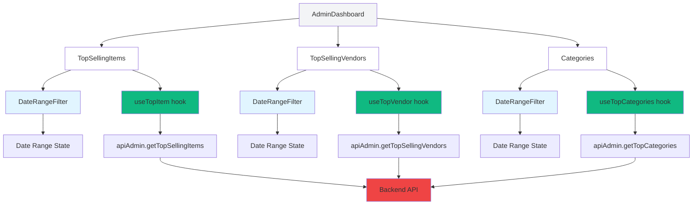

# Date Range Filter Architecture Specification
## Admin Dashboard Dynamic Date Filtering

**Version:** 1.0  
**Date:** 2026-01-06  
**Status:** Design Document

---

## Executive Summary

This document defines the architecture for implementing dynamic date range filtering across admin dashboard components. The design enables users to select custom date ranges (start date and end date) that trigger data updates across all dashboard modules.

---

## 1. Date Range State Management Strategy

### 1.1 Approach: Component-Level State Management

**Decision:** Each dashboard component manages its own date range state independently.

**Rationale:**
- Components can have different date ranges for different analysis purposes
- Simpler implementation without context API overhead
- Each component can be reused independently
- Matches existing component structure (no parent state propagation needed)

### 1.2 State Structure

```typescript
interface DateRangeState {
  startDate: Date | null;
  endDate: Date | null;
}
```

### 1.3 Default Values

- **Default to current month** when component mounts
- Start date: First day of current month (e.g., 2026-01-01)
- End date: Last day of current month (e.g., 2026-01-31)

### 1.4 Date Format for Backend

The backend expects `year` and `month` query parameters. Conversion logic:

```typescript
function convertDateRangeToMonthYear(startDate: Date, endDate: Date): { year: number; month: number } {
  // Use the start date to determine the target month/year
  return {
    year: startDate.getFullYear(),
    month: startDate.getMonth() + 1 // 1-12
  };
}
```

**Note:** For custom date ranges spanning multiple months, the backend will filter by the start date's month/year. This is a limitation of the current backend implementation.

---

## 2. DateRangeFilter Component Specification

### 2.1 Component Location

`client/src/ui/DateRangeFilter.jsx`

### 2.2 Props Interface

```typescript
interface DateRangeFilterProps {
  startDate: Date | null;
  endDate: Date | null;
  onDateChange: (startDate: Date | null, endDate: Date | null) => void;
  label?: string; // Optional label for accessibility
  disabled?: boolean; // Optional disabled state
}
```

### 2.3 UI Design

**Layout:**
- Two date input fields side by side
- Start date on the left, end date on the right
- Calendar icon for each field
- Chevron down icon for dropdown indication

**Visual Style (Tailwind CSS):**
- Compact, inline design
- Border: `border-gray-300`
- Background: `bg-white`
- Text: `text-sm text-gray-700`
- Hover: `hover:bg-gray-50`
- Rounded: `rounded-md`
- Padding: `px-2 py-1`

### 2.4 Event Handling

```typescript
const handleStartDateChange = (date: Date | null) => {
  onDateChange(date, endDate);
};

const handleEndDateChange = (date: Date | null) => {
  onDateChange(startDate, date);
};
```

### 2.5 Date Picker Library

Use `react-datepicker` (already likely in project dependencies) or native HTML5 date inputs.

**Recommended:** `react-datepicker` for better UX with:
- Calendar popup
- Month/year navigation
- Date validation
- Custom styling support

---

## 3. Component Integration Architecture

### 3.1 Component Hierarchy

```
AdminDashboard (Parent)
├── TopSellingItems (Independent Date Filter)
├── TopSellingVendors (Independent Date Filter)
└── Categories (Independent Date Filter)
```

### 3.2 TopSellingItems.jsx Integration

**Changes Required:**

1. Add state for date range:
```javascript
const [dateRange, setDateRange] = useState({
  startDate: getCurrentMonthStart(),
  endDate: getCurrentMonthEnd()
});
```

2. Replace placeholder button with DateRangeFilter:
```jsx
<DateRangeFilter
  startDate={dateRange.startDate}
  endDate={dateRange.endDate}
  onDateChange={setDateRange}
/>
```

3. Pass date parameters to hook:
```javascript
const { topItem, isLoading, error } = useTopItem(dateRange);
```

### 3.3 TopSellingVendors.jsx Integration

**Same pattern as TopSellingItems.jsx:**
- Add date range state
- Replace placeholder button with DateRangeFilter
- Pass date parameters to useTopVendor hook

### 3.4 Categories.jsx Integration

**Same pattern as TopSellingItems.jsx:**
- Add date range state
- Replace placeholder button with DateRangeFilter
- Pass date parameters to useTopCategories hook

### 3.5 AdminDashboard.jsx Changes

**Minimal changes required:**
- Remove the global "This Month" button from header (line 61-63)
- Child components now manage their own filters independently

---

## 4. React Query Integration

### 4.1 Query Key Modification Strategy

**Current (Static):**
```javascript
queryKey: ["top-item"]
```

**New (Dynamic with Date):**
```javascript
queryKey: ["top-item", year, month]
```

### 4.2 Hook Signature Changes

#### useTopItem.js

```javascript
export function useTopItem(dateRange) {
  const { year, month } = convertDateRangeToMonthYear(
    dateRange.startDate,
    dateRange.endDate
  );

  const { data, isLoading, error } = useQuery({
    queryKey: ["top-item", year, month],
    queryFn: () => getTopSellingItems(year, month),
    retry: false,
    staleTime: 5 * 60 * 1000,
    cacheTime: 10 * 60 * 1000,
    refetchOnWindowFocus: false,
    refetchOnMount: false,
  });

  return { topItem: data || [], isLoading, error };
}
```

#### useTopVendor.js

```javascript
export function useTopVendor(dateRange) {
  const { year, month } = convertDateRangeToMonthYear(
    dateRange.startDate,
    dateRange.endDate
  );

  const { data, isLoading, error } = useQuery({
    queryKey: ["top-vendor", year, month],
    queryFn: () => getTopSellingVendors(year, month),
    retry: false,
    staleTime: 5 * 60 * 1000,
    cacheTime: 10 * 60 * 1000,
    refetchOnWindowFocus: false,
    refetchOnMount: false,
  });

  return { topVendor: data || [], isLoading, error };
}
```

#### useTopCategories.js

```javascript
export function useTopCategories(dateRange) {
  const { year, month } = convertDateRangeToMonthYear(
    dateRange.startDate,
    dateRange.endDate
  );

  const { data, isLoading, error } = useQuery({
    queryKey: ["top-categories", year, month],
    queryFn: () => getTopCategories(year, month),
    retry: false,
    staleTime: 5 * 60 * 1000,
    cacheTime: 10 * 60 * 1000,
    refetchOnWindowFocus: false,
    refetchOnMount: false,
  });

  return { topCategories: data || [], isLoading, error };
}
```

### 4.3 Automatic Refetch Mechanism

React Query automatically refetches when the `queryKey` changes. When date range changes:
1. Component updates state with new dates
2. Hook receives new date range
3. `year` and `month` values change
4. `queryKey` array changes
5. React Query detects key change and triggers refetch

---

## 5. API Service Layer Updates

### 5.1 Function Signature Changes

#### apiAdmin.js

```javascript
// Before
export async function getTopSellingItems() {
  const { data } = await axiosInstance.get('/admin/dashboard/top-selling-items');
  return data.data;
}

// After
export async function getTopSellingItems(year, month) {
  const params = {};
  if (year) params.year = year;
  if (month) params.month = month;
  
  const { data } = await axiosInstance.get('/admin/dashboard/top-selling-items', { params });
  return data.data;
}

export async function getTopSellingVendors(year, month) {
  const params = {};
  if (year) params.year = year;
  if (month) params.month = month;
  
  const { data } = await axiosInstance.get('/admin/dashboard/top-selling-vendors', { params });
  return data.data;
}

export async function getTopCategories(year, month) {
  const params = {};
  if (year) params.year = year;
  if (month) params.month = month;
  
  const { data } = await axiosInstance.get('/admin/dashboard/top-categories', { params });
  return data.data;
}
```

### 5.2 API Endpoint Format

The backend already supports these parameters:

```
GET /admin/dashboard/top-selling-items?year=2026&month=1
GET /admin/dashboard/top-selling-vendors?year=2026&month=1
GET /admin/dashboard/top-categories?year=2026&month=1
```

### 5.3 Response Format (Unchanged)

Backend returns consistent format with metadata:

```json
{
  "status": "success",
  "data": [...],
  "metadata": {
    "period": "January 2026",
    "dateRange": {
      "start": "2026-01-01T00:00:00.000Z",
      "end": "2026-02-01T00:00:00.000Z"
    },
    "isFuture": false,
    "isDefault": false
  }
}
```

---

## 6. Data Flow Diagram



---

## 7. Component Architecture Diagram



---

## 8. Implementation Considerations

### 8.1 Performance Implications

**Caching Strategy:**
- React Query automatically caches responses per unique queryKey
- Different date ranges have separate cache entries
- No manual cache invalidation needed
- `staleTime: 5 minutes` balances freshness with performance

**Debouncing:**
- Not required for date picker changes (user selects, then changes)
- If implementing typing, consider 500ms debounce

### 8.2 Edge Cases

**Invalid Dates:**
- Start date after end date: Show validation error
- Future dates: Allow (for planning), but backend may return empty data
- Null dates: Default to current month

**Empty Data:**
- Backend returns empty array with metadata
- Components should handle empty state gracefully
- Show "No data for selected period" message

**Date Range Spanning Multiple Months:**
- Current backend limitation: Only filters by start date's month/year
- Future enhancement: Backend could support full date range filtering
- Current workaround: Document this limitation to users

### 8.3 Error Handling

**API Errors:**
- React Query `retry: false` prevents automatic retries
- Display error message in component
- Allow retry on manual refresh

**Date Validation:**
- Validate dates before sending to API
- Show inline validation errors
- Disable filter button during invalid state

### 8.4 Accessibility

**Keyboard Navigation:**
- Tab order: Start date → End date
- Enter/Space to open date picker
- Escape to close date picker

**Screen Reader Support:**
- ARIA labels on date inputs
- Announce date changes
- Error announcements

**Visual Indicators:**
- Clear focus states
- Hover states for interactive elements
- Disabled state styling

---

## 9. File Structure Changes

### New Files

```
client/src/ui/DateRangeFilter.jsx
client/src/utils/dateHelpers.js
```

### Modified Files

```
client/src/Features/admin/dashboard/AdminDashboard.jsx
client/src/Features/admin/dashboard/TopSellingItems.jsx
client/src/Features/admin/dashboard/TopSellingVendors.jsx
client/src/Features/admin/dashboard/Categories.jsx
client/src/Features/admin/dashboard/useTopItem.js
client/src/Features/admin/dashboard/useTopVendor.js
client/src/Features/admin/dashboard/useTopCategories.js
client/src/services/apiAdmin.js
```

---

## 10. Trade-offs and Considerations

### 10.1 Trade-offs

| Decision | Benefit | Trade-off |
|-----------|----------|------------|
| Component-level state | Simple, independent | No shared state, potential for inconsistent dates across components |
| Month/year backend params | Leverages existing backend | Limited to single-month filtering, not full date ranges |
| No debouncing | Immediate feedback | Multiple rapid changes trigger multiple API calls |
| Static stale time | Predictable cache behavior | Stale data if another user updates |

### 10.2 Future Enhancements

1. **Shared Date Context:** If users want synchronized filters across all components
2. **Full Date Range Backend:** Backend accepts `startDate` and `endDate` directly
3. **Preset Quick Filters:** "Last 7 Days", "Last 30 Days", "This Quarter"
4. **Date Range Comparison:** Show period-over-period comparison
5. **Export Functionality:** Export filtered data as CSV/Excel

---

## 11. Testing Strategy

### 11.1 Unit Tests

- DateRangeFilter component rendering and interaction
- Date helper functions (conversion, validation)
- Hook parameter passing and queryKey generation

### 11.2 Integration Tests

- Component state updates trigger API calls
- Date range changes propagate correctly
- Error states display properly

### 11.3 Manual Testing Checklist

- [ ] Default to current month on mount
- [ ] Select past month shows historical data
- [ ] Select future month shows empty or limited data
- [ ] Invalid date range shows error
- [ ] Each component works independently
- [ ] Loading states display correctly
- [ ] Error states display correctly

---

## Appendix A: Helper Functions

### dateHelpers.js

```javascript
/**
 * Get the first day of the current month
 */
export function getCurrentMonthStart() {
  const now = new Date();
  return new Date(now.getFullYear(), now.getMonth(), 1);
}

/**
 * Get the last day of the current month
 */
export function getCurrentMonthEnd() {
  const now = new Date();
  return new Date(now.getFullYear(), now.getMonth() + 1, 0);
}

/**
 * Convert date range to year/month for backend API
 * @param {Date} startDate - Start date of range
 * @param {Date} endDate - End date of range
 * @returns {Object} { year: number, month: number }
 */
export function convertDateRangeToMonthYear(startDate, endDate) {
  if (!startDate) {
    const now = new Date();
    return {
      year: now.getFullYear(),
      month: now.getMonth() + 1
    };
  }
  
  return {
    year: startDate.getFullYear(),
    month: startDate.getMonth() + 1
  };
}

/**
 * Format date for display
 * @param {Date} date - Date to format
 * @returns {string} Formatted date string
 */
export function formatDateDisplay(date) {
  if (!date) return '';
  return date.toLocaleDateString('en-US', {
    year: 'numeric',
    month: 'short',
    day: 'numeric'
  });
}
```

---

**Document End**
