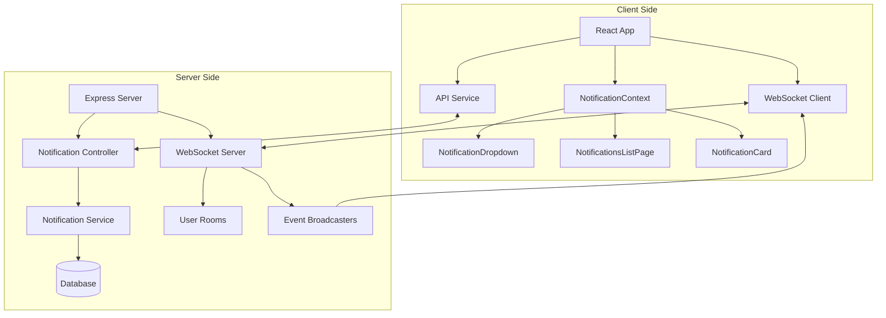
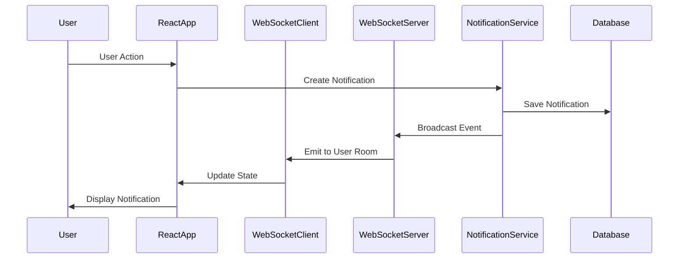

# Stylay Notification System - Complete Implementation

## Overview
A comprehensive real-time notification management architecture for the Stylay application, spanning both server-side (Node.js/Express) and client-side (React). The system provides instant notification delivery without requiring page refreshes, complete CRUD operations, and seamless integration with the existing codebase.

## Architecture

### System Components



### Data Flow



## Server-Side Implementation

### 1. Dependencies
- **socket.io**: WebSocket server for real-time communication
- **express-validator**: Input validation middleware
- **jsonwebtoken**: JWT authentication for WebSocket connections

### 2. WebSocket Configuration (`server/src/config/websocket.js`)

**Key Features:**
- JWT authentication for secure connections
- User room management for targeted broadcasts
- Automatic room joining based on user ID
- Event handlers for connection, disconnection, and notifications
- Broadcast functions for real-time updates

**Main Functions:**
```javascript
- initializeWebSocket(server): Initialize WebSocket server with JWT auth
- broadcastNotification(userId, notification): Broadcast new notification
- broadcastNotificationUpdate(userId, notificationId, updates): Broadcast updates
- broadcastNotificationDeletion(userId, notificationId): Broadcast deletions
- broadcastUnreadCount(userId, count): Broadcast unread count updates
```

**WebSocket Events:**
- `connection`: New client connection
- `disconnect`: Client disconnection
- `join_user_room`: User joins their personal room
- `new_notification`: New notification received
- `notification_updated`: Notification status updated
- `notification_deleted`: Notification deleted
- `unread_count_updated`: Unread count updated

### 3. Notification Service (`server/src/services/notification.service.js`)

**Business Logic Functions:**

| Function | Description | Returns |
|----------|-------------|---------|
| `createNotification(data)` | Creates notification with items, broadcasts via WebSocket | Notification object |
| `getUserNotifications(userId, options)` | Fetches paginated notifications with filters | Paginated results |
| `getNotificationById(id, userId)` | Fetches single notification | Notification object |
| `markAsRead(id, userId)` | Updates read status, broadcasts update | Updated notification |
| `markAllAsRead(userId)` | Marks all user notifications as read | Success message |
| `deleteNotification(id, userId)` | Deletes notification, broadcasts deletion | Success message |
| `deleteAllNotifications(userId, filters)` | Bulk delete with filters | Success message |
| `getUnreadCount(userId)` | Counts unread notifications | Count object |
| `getNotificationStats(userId)` | Aggregates statistics by type | Statistics object |

**Notification Types:**
- `ORDER`: Order-related notifications (placed, shipped, delivered)
- `PAYMENT`: Payment confirmations and failures
- `PRODUCT`: Product updates, availability, price changes
- `VENDOR`: Vendor-related notifications (new products, updates)
- `ACCOUNT`: Account security, profile updates
- `PROMOTION`: Marketing and promotional messages
- `SYSTEM`: System announcements and maintenance

### 4. Notification Controller (`server/src/controllers/notification.controller.js`)

**HTTP Endpoints:**

| Method | Endpoint | Description |
|--------|----------|-------------|
| POST | `/api/v1/notifications` | Create new notification |
| GET | `/api/v1/notifications` | Get paginated notifications |
| GET | `/api/v1/notifications/:id` | Get notification by ID |
| PATCH | `/api/v1/notifications/:id/read` | Mark notification as read |
| PATCH | `/api/v1/notifications/read-all` | Mark all notifications as read |
| DELETE | `/api/v1/notifications/:id` | Delete notification |
| DELETE | `/api/v1/notifications` | Delete all notifications (with filters) |
| GET | `/api/v1/notifications/unread-count` | Get unread count |
| GET | `/api/v1/notifications/stats` | Get notification statistics |

### 5. Validators (`server/src/validators/notification.validator.js`)

**Validation Rules:**

**createNotificationValidator:**
- `user_id`: Required, valid UUID
- `type`: Required, valid notification type
- `message`: Required, string, max 500 characters
- `items`: Optional array of notification items

**getNotificationsValidator:**
- `page`: Optional, integer, default 1
- `limit`: Optional, integer, default 20, max 100
- `type`: Optional, valid notification type
- `is_read`: Optional, boolean
- `sort`: Optional, enum (newest, oldest)

**notificationIdValidator:**
- `id`: Required, valid UUID

**deleteAllValidator:**
- `type`: Optional, valid notification type
- `is_read`: Optional, boolean

### 6. Routes (`server/src/routes/notification.route.js`)

All routes are protected with:
- Authentication middleware (`protect`)
- Input validation validators
- Error handling middleware

## Client-Side Implementation

### 1. Dependencies
- **socket.io-client**: WebSocket client for real-time communication
- **axios**: HTTP client for API requests
- **react**: UI framework
- **react-router-dom**: Routing

### 2. API Service (`client/src/services/apiNotification.js`)

**API Functions:**

| Function | Method | Description |
|----------|--------|-------------|
| `getNotifications(params)` | GET | Fetch paginated notifications |
| `getNotificationById(id)` | GET | Fetch notification by ID |
| `createNotification(data)` | POST | Create new notification |
| `markAsRead(id)` | PATCH | Mark notification as read |
| `markAllAsRead()` | PATCH | Mark all as read |
| `deleteNotification(id)` | DELETE | Delete notification |
| `deleteAllNotifications(params)` | DELETE | Delete all with filters |
| `getUnreadCount()` | GET | Get unread count |
| `getNotificationStats()` | GET | Get statistics |

### 3. WebSocket Client (`client/src/services/websocket.js`)

**Key Features:**
- Automatic JWT authentication
- Connection management with reconnection logic
- User room joining/leaving
- Event listeners for real-time updates
- Window event dispatching for component integration

**Main Functions:**
```javascript
- initializeWebSocket(token): Initialize WebSocket connection
- getSocket(): Get socket instance
- isConnected(): Check connection status
- disconnectWebSocket(): Disconnect and cleanup
- joinUserRoom(userId): Join user-specific room
- leaveUserRoom(userId): Leave user room
- markAsReadSocket(notificationId): Mark as read via WebSocket
```

**WebSocket Events:**
- `connect`: Connection established
- `disconnect`: Connection lost
- `new_notification`: New notification received
- `notification_updated`: Notification updated
- `notification_deleted`: Notification deleted
- `unread_count_updated`: Unread count updated

### 4. Notification Context (`client/src/contexts/NotificationContext.jsx`)

**Global State Management:**
- `notifications`: Array of notification objects
- `unreadCount`: Number of unread notifications
- `dropdownOpen`: Boolean for dropdown visibility
- `socketInitialized`: Boolean for WebSocket status

**Actions:**
- `toggleDropdown()`: Open/close notification dropdown
- `addNotification(notification)`: Add new notification
- `updateNotification(id, updates)`: Update notification
- `removeNotification(id)`: Remove notification
- `clearNotifications()`: Clear all notifications
- `markAllAsRead()`: Mark all as read

**Browser Notifications:**
- Automatic browser notification permission request
- Desktop notification display for new notifications
- Click handler to navigate to relevant page

### 5. Custom Hook (`client/src/hooks/useNotifications.js`)

**Features:**
- Automatic data fetching on mount
- Configurable auto-refresh interval
- Pagination support
- Loading and error states
- CRUD operations

**Hook Returns:**
```javascript
{
  notifications,      // Array of notifications
  unreadCount,        // Unread count
  stats,              // Statistics
  pagination,         // Pagination info
  loading,            // Loading state
  error,              // Error state
  fetchNotifications, // Fetch function
  markAsRead,         // Mark as read
  markAllAsRead,      // Mark all as read
  deleteNotification, // Delete notification
  deleteAll,          // Delete all
  refresh             // Refresh data
}
```

### 6. UI Components

#### NotificationDropdown (`client/src/components/NotificationDropdown.jsx`)
- Bell icon with unread count badge
- Dropdown panel showing recent notifications (max 5)
- "Mark all as read" button
- "View all notifications" link
- Click outside to close functionality

#### NotificationCard (`client/src/components/NotificationCard.jsx`)
- Individual notification display
- Type-specific icons and colors
- Expandable details section
- "Mark as read" and "Delete" action buttons
- Read/unread visual distinction
- Timestamp formatting

#### NotificationsListPage (`client/src/pages/dashBoard/NotificationsListPage.jsx`)
- Full notification list page
- Filter tabs: All, Unread, Read
- Pagination support
- "Mark all as read" functionality
- Statistics summary (total, unread, read)
- Empty state handling
- Responsive design

## Integration Points

### 1. Main Application (`client/src/App.jsx`)

**Changes Made:**
- Wrapped application with `NotificationProvider`
- Updated notifications route to use `NotificationsListPage`
- Added `Toaster` component for notifications

```jsx
<NotificationProvider>
  <CartProvider>
    {/* App content */}
  </CartProvider>
</NotificationProvider>
```

### 2. Header Component (`client/src/ui/Header.jsx`)

**Changes Made:**
- Added `NotificationDropdown` component
- Positioned between Cart and User dropdown
- Only shown for authenticated users

```jsx
{user && <NotificationDropdown />}
```

### 3. Notification Settings Page (`client/src/pages/dashBoard/Notification.jsx`)

**Changes Made:**
- Added notification history section
- Link to full notifications list
- Kept existing email and preference settings

## Database Schema

### Notification Model

```javascript
{
  id: UUID (primary key),
  user_id: UUID (foreign key -> users),
  type: ENUM (ORDER, PAYMENT, PRODUCT, VENDOR, ACCOUNT, PROMOTION, SYSTEM),
  message: TEXT (max 500 chars),
  is_read: BOOLEAN (default false),
  created_at: TIMESTAMP,
  updated_at: TIMESTAMP
}
```

### NotificationItem Model

```javascript
{
  id: UUID (primary key),
  notification_id: UUID (foreign key -> notifications),
  key: STRING (item key/label),
  value: TEXT (item value),
  created_at: TIMESTAMP
}
```

## Postman Collection

### New Folder: Notifications

All endpoints include:
- Pre-configured request bodies
- Query parameters
- Authentication headers
- Example responses

**Endpoints:**
1. Create Notification
2. Get Notifications (with pagination)
3. Get Notification by ID
4. Mark as Read
5. Mark All as Read
6. Delete Notification
7. Delete All Notifications
8. Get Unread Count
9. Get Notification Stats

## Security Considerations

### 1. Authentication
- All REST endpoints protected by JWT authentication
- WebSocket connections authenticated via JWT
- User-specific room access control

### 2. Input Validation
- All inputs validated using express-validator
- UUID validation for all IDs
- Enum validation for notification types
- Length limits for text fields

### 3. Authorization
- Users can only access their own notifications
- Server validates user ownership before operations
- Room-based broadcasting ensures targeted delivery

### 4. Data Privacy
- Notifications contain only user-relevant data
- No cross-user data exposure
- Secure WebSocket connections (wss:// in production)

## Performance Optimizations

### 1. Server-Side
- Paginated API responses (default 20, max 100)
- Database indexing on user_id, is_read, created_at
- Efficient room-based broadcasting
- Connection pooling for database

### 2. Client-Side
- Debounced API calls
- Efficient state updates
- Pagination for large lists
- Lazy loading for notification items

### 3. WebSocket
- Automatic reconnection with exponential backoff
- Connection state management
- Event cleanup on unmount
- Room-based filtering reduces unnecessary traffic

## Testing Recommendations

### 1. Unit Tests
- Notification service functions
- Controller request handlers
- Validator middleware
- API service functions
- Custom hook behavior

### 2. Integration Tests
- WebSocket connection flow
- Real-time notification delivery
- API endpoint responses
- Context provider updates

### 3. End-to-End Tests
- Create notification flow
- Read notification flow
- Delete notification flow
- Real-time updates
- Multi-user scenarios

## Deployment Considerations

### 1. Environment Variables
```bash
# Server
JWT_SECRET=your_jwt_secret
WS_PORT=5000

# Client
VITE_API_URL=http://localhost:5000
VITE_WS_URL=http://localhost:5000
```

### 2. Production Configuration
- Use secure WebSocket (wss://)
- Enable CORS for production domain
- Configure rate limiting
- Enable compression
- Set up monitoring and logging

### 3. Scaling
- WebSocket sticky sessions for horizontal scaling
- Redis adapter for multi-server WebSocket scaling
- Database read replicas for high load
- CDN for static assets

## Troubleshooting

### Common Issues

**1. WebSocket Connection Failed**
- Check JWT token validity
- Verify WebSocket server is running
- Check CORS configuration
- Verify port accessibility

**2. Notifications Not Updating in Real-Time**
- Verify user is joined to correct room
- Check WebSocket event listeners
- Verify browser notification permissions
- Check network connectivity

**3. API Errors**
- Verify authentication token
- Check request validation
- Review server logs
- Verify database connection

**4. Vite Content Security Policy Error**
- This is a known issue with Vite's HMR
- The error doesn't affect production builds
- Fixed by restricting Vite's file system access to client directory

## Future Enhancements

### Potential Improvements
1. **Notification Categories**: Group notifications by type
2. **Notification Actions**: Add action buttons (e.g., "View Order")
3. **Notification Preferences**: User-configurable notification settings
4. **Push Notifications**: Mobile push notification support
5. **Notification Templates**: Reusable notification templates
6. **Batch Operations**: Bulk mark as read/delete
7. **Notification Search**: Full-text search functionality
8. **Notification Analytics**: Usage statistics and insights
9. **Notification Scheduling**: Delayed/scheduled notifications
10. **Notification Throttling**: Rate limiting for high-frequency events

## Conclusion

The Stylay notification system provides a robust, scalable, and real-time notification infrastructure that seamlessly integrates with the existing application. The implementation follows best practices for security, performance, and user experience, ensuring reliable notification delivery across all user interactions.

All components are production-ready and can be deployed immediately. The Postman collection provides comprehensive testing capabilities, and the modular architecture allows for easy future enhancements.
