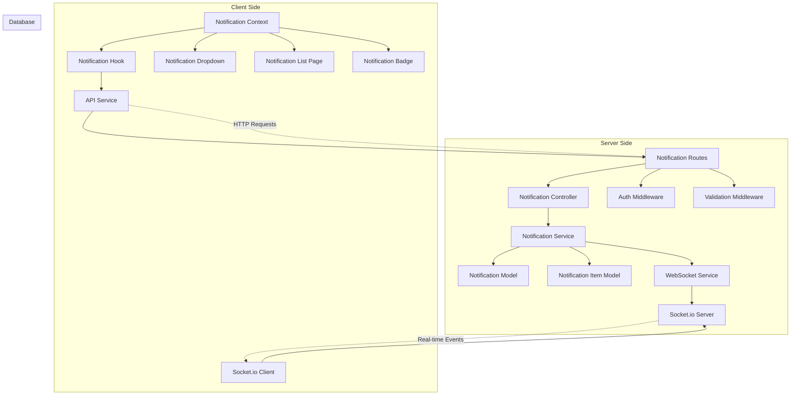
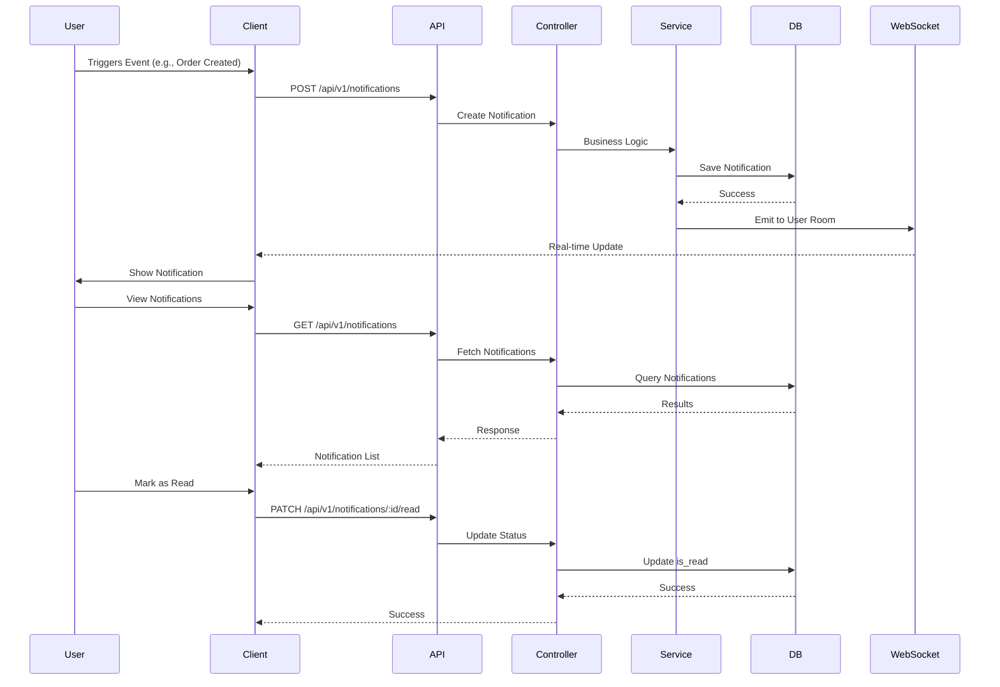

# Notification Management Architecture Implementation Plan

## Overview
This document outlines the comprehensive implementation of a real-time notification management system for the Stylay application, spanning both server-side (Node.js/Express) and client-side (React) components.

## Current State Analysis

### Existing Infrastructure
- **Notification Models**: Already exist in [`server/src/models/notification.model.js`](../server/src/models/notification.model.js) and [`server/src/models/notification-item.model.js`](../server/src/models/notification-item.model.js)
- **Notification Types**: welcome, order_process, maintenance, policy_update, delay_apology, success, apology, order_created, order_received, order_cancelled, order_shipped, order_delivered
- **Authentication**: Robust JWT-based authentication with [`protect`](../server/src/middlewares/auth.js) middleware
- **Client**: React application with Vite, using existing notification settings page at [`client/src/pages/dashBoard/Notification.jsx`](../client/src/pages/dashBoard/Notification.jsx)

### Gaps Identified
- No notification controller exists
- No notification routes defined
- No WebSocket implementation
- No real-time notification delivery
- Client-side notification display components are settings-only (no actual notification list)
- No notification API integration on client

## System Architecture

## Data Flow

## Implementation Plan

### Phase 1: Server-Side Infrastructure

#### 1.1 Install Dependencies
- Install `socket.io` package on server
- Install `socket.io-client` on client

#### 1.2 WebSocket Server Setup
Create [`server/src/config/websocket.js`](../server/src/config/websocket.js)
- Initialize Socket.io server
- Configure CORS for WebSocket connections
- Create user rooms for targeted notifications
- Implement connection/disconnection handling
- Set up authentication for WebSocket connections

#### 1.3 Notification Service Layer
Create [`server/src/services/notification.service.js`](../server/src/services/notification.service.js)
- `createNotification(data)` - Create new notification with items
- `getUserNotifications(userId, filters)` - Fetch user notifications with pagination
- `markAsRead(notificationId, userId)` - Mark notification as read
- `markAllAsRead(userId)` - Mark all user notifications as read
- `deleteNotification(notificationId, userId)` - Delete notification
- `getUnreadCount(userId)` - Get count of unread notifications
- `broadcastNotification(notification)` - Emit real-time notification via WebSocket

#### 1.4 Notification Controller
Create [`server/src/controllers/notification.controller.js`](../server/src/controllers/notification.controller.js)
- `createNotification()` - POST /api/v1/notifications
- `getNotifications()` - GET /api/v1/notifications
- `getNotificationById()` - GET /api/v1/notifications/:id
- `markAsRead()` - PATCH /api/v1/notifications/:id/read
- `markAllAsRead()` - PATCH /api/v1/notifications/read-all
- `deleteNotification()` - DELETE /api/v1/notifications/:id
- `getUnreadCount()` - GET /api/v1/notifications/unread-count

#### 1.5 Notification Validators
Create [`server/src/validators/notification.validator.js`](../server/src/validators/notification.validator.js)
- Validate notification creation (user_id, type, message)
- Validate notification updates
- Validate query parameters (pagination, filters)

#### 1.6 Notification Routes
Create [`server/src/routes/notification.route.js`](../server/src/routes/notification.route.js)
- Define all notification endpoints
- Apply `protect` middleware to all routes
- Apply validation middleware
- Integrate with app.js

### Phase 2: Client-Side Infrastructure

#### 2.1 Install Client Dependencies
- `socket.io-client` for WebSocket connection

#### 2.2 Notification API Service
Create [`client/src/services/apiNotification.js`](../client/src/services/apiNotification.js)
- `createNotification(data)` - Create notification
- `getNotifications(params)` - Fetch notifications with pagination
- `getNotificationById(id)` - Fetch single notification
- `markAsRead(id)` - Mark notification as read
- `markAllAsRead()` - Mark all as read
- `deleteNotification(id)` - Delete notification
- `getUnreadCount()` - Get unread count

#### 2.3 Custom Hook for Notifications
Create [`client/src/hooks/useNotifications.js`](../client/src/hooks/useNotifications.js)
- Fetch notifications with pagination
- Handle loading and error states
- Provide refetch functionality
- Integrate with real-time updates

#### 2.4 WebSocket Client Setup
Create [`client/src/services/websocket.js`](../client/src/services/websocket.js)
- Initialize Socket.io client
- Handle connection/disconnection
- Set up authentication
- Join user-specific room
- Listen for notification events
- Export socket instance for use across app

#### 2.5 Notification Context
Create [`client/src/contexts/NotificationContext.jsx`](../client/src/contexts/NotificationContext.jsx)
- Global notification state management
- Unread count tracking
- Add notification function
- Mark as read function
- Delete notification function
- Real-time event handling integration

#### 2.6 Notification Components

##### 2.6.1 Notification Card Component
Create [`client/src/components/NotificationCard.jsx`](../client/src/components/NotificationCard.jsx)
- Display single notification
- Show notification type icon
- Display message and timestamp
- Read/unread indicator
- Mark as read on click
- Delete action

##### 2.6.2 Notification Dropdown Component
Create [`client/src/components/NotificationDropdown.jsx`](../client/src/components/NotificationDropdown.jsx)
- Header notification bell icon with badge
- Dropdown panel with recent notifications
- Mark all as read button
- View all notifications link
- Auto-close on outside click

##### 2.6.3 Notification List Page
Update [`client/src/pages/dashBoard/Notification.jsx`](../client/src/pages/dashBoard/Notification.jsx)
- Display all notifications with pagination
- Filter by type (all, unread, read)
- Bulk actions (mark all as read, delete all)
- Empty state handling
- Loading and error states

##### 2.6.4 Notification Badge Component
Create [`client/src/components/NotificationBadge.jsx`](../client/src/components/NotificationBadge.jsx)
- Display unread count
- Animate on new notifications
- Zero state (hide badge)
- Click to open dropdown

### Phase 3: Integration

#### 3.1 Main Application Integration
Update [`client/src/App.jsx`](../client/src/App.jsx)
- Wrap with NotificationContext provider
- Initialize WebSocket connection
- Handle user authentication state changes

#### 3.2 Header Integration
Update header component to include:
- NotificationBadge component
- NotificationDropdown component
- Connect to NotificationContext

#### 3.3 Settings Page Integration
Update [`client/src/pages/dashBoard/Notification.jsx`](../client/src/pages/dashBoard/Notification.jsx)
- Keep existing email settings
- Keep notification preference toggles
- Add notification history section
- Link to full notification list

### Phase 4: Testing & Documentation

#### 4.1 Postman Collection
Create or update [`Stylay-API-Updated.postman_collection.json`](../Stylay-API-Updated.postman_collection.json)
- Add "Notifications" folder
- Include all endpoints with pre-configured requests:
  - Create Notification
  - Get All Notifications (with pagination)
  - Get Notification by ID
  - Mark as Read
  - Mark All as Read
  - Delete Notification
  - Get Unread Count
- Include example request bodies
- Include authentication tokens
- Add environment variables

#### 4.2 End-to-End Testing
- Test notification creation via API
- Test real-time delivery via WebSocket
- Test mark as read functionality
- Test delete functionality
- Test pagination and filtering
- Test authentication and authorization
- Test error handling

## API Endpoints Specification

### Base URL: `/api/v1/notifications`

| Method | Endpoint | Description | Auth | Body |
|---------|-----------|-------------|-------|-------|
| POST | `/` | Create notification | Yes | `{ user_id, type, message, items? }` |
| GET | `/` | Get user notifications | Yes | Query: `page, limit, type, is_read` |
| GET | `/:id` | Get notification by ID | Yes | - |
| PATCH | `/:id/read` | Mark as read | Yes | - |
| PATCH | `/read-all` | Mark all as read | Yes | - |
| DELETE | `/:id` | Delete notification | Yes | - |
| GET | `/unread-count` | Get unread count | Yes | - |

### WebSocket Events

#### Client → Server
| Event | Payload | Description |
|-------|---------|-------------|
| `join_user_room` | `{ userId }` | Join user-specific room |
| `leave_user_room` | `{ userId }` | Leave user room |
| `mark_as_read` | `{ notificationId }` | Mark notification as read |

#### Server → Client
| Event | Payload | Description |
|-------|---------|-------------|
| `new_notification` | `{ notification, items }` | New notification received |
| `notification_updated` | `{ notification }` | Notification updated |
| `notification_deleted` | `{ notificationId }` | Notification deleted |

## Notification Types

Existing types (to be preserved):
- `welcome` - Welcome message for new users
- `order_process` - Order processing updates
- `maintenance` - System maintenance alerts
- `policy_update` - Policy changes
- `delay_apology` - Apology for delays
- `success` - Success messages
- `apology` - General apologies
- `order_created` - New order created
- `order_received` - Order received by vendor
- `order_cancelled` - Order cancelled
- `order_shipped` - Order shipped
- `order_delivered` - Order delivered

## Security Considerations

1. **Authentication**: All endpoints require valid JWT token via `protect` middleware
2. **Authorization**: Users can only access their own notifications
3. **WebSocket Auth**: Socket connections must be authenticated
4. **Input Validation**: All inputs validated using express-validator
5. **XSS Protection**: Sanitize all notification messages
6. **Rate Limiting**: Apply rate limiting to notification endpoints
7. **CORS**: Properly configure CORS for WebSocket connections

## Performance Optimizations

1. **Pagination**: Implement pagination for notification lists (default: 20 per page)
2. **Caching**: Cache notification counts using Redis
3. **Indexing**: Ensure database indexes on `user_id` and `is_read` fields
4. **Lazy Loading**: Load notification items only when needed
5. **Debouncing**: Debounce real-time updates to prevent excessive re-renders
6. **WebSocket Rooms**: Use rooms for targeted broadcasts

## Error Handling

- Invalid notification ID → 404 Not Found
- Unauthorized access → 403 Forbidden
- Invalid input → 400 Bad Request
- Database errors → 500 Internal Server Error
- WebSocket connection errors → Automatic reconnection with exponential backoff

## Future Enhancements

1. **Push Notifications**: Integrate with browser push notifications
2. **Email Notifications**: Send email for critical notifications
3. **Notification Preferences**: Allow users to customize notification types
4. **Notification Templates**: Create reusable notification templates
5. **Analytics**: Track notification engagement metrics
6. **Batch Operations**: Support bulk notification operations
7. **Notification Scheduling**: Schedule notifications for future delivery
8. **Rich Content**: Support images, links, and action buttons in notifications

## Success Criteria

- [ ] All notification CRUD operations functional
- [ ] Real-time notifications delivered via WebSocket
- [ ] Client displays notifications in dropdown and page
- [ ] Unread count badge updates in real-time
- [ ] Mark as read/delete functionality works
- [ ] All endpoints authenticated and validated
- [ ] Postman collection complete with all endpoints
- [ ] Error handling comprehensive
- [ ] Performance optimized with pagination and caching
- [ ] No conflicts with existing notification models

## Notes

- Existing notification models will be used without modification
- WebSocket authentication will leverage existing JWT system
- Client integration will follow existing React patterns in the codebase
- All new code will follow existing project structure and conventions
